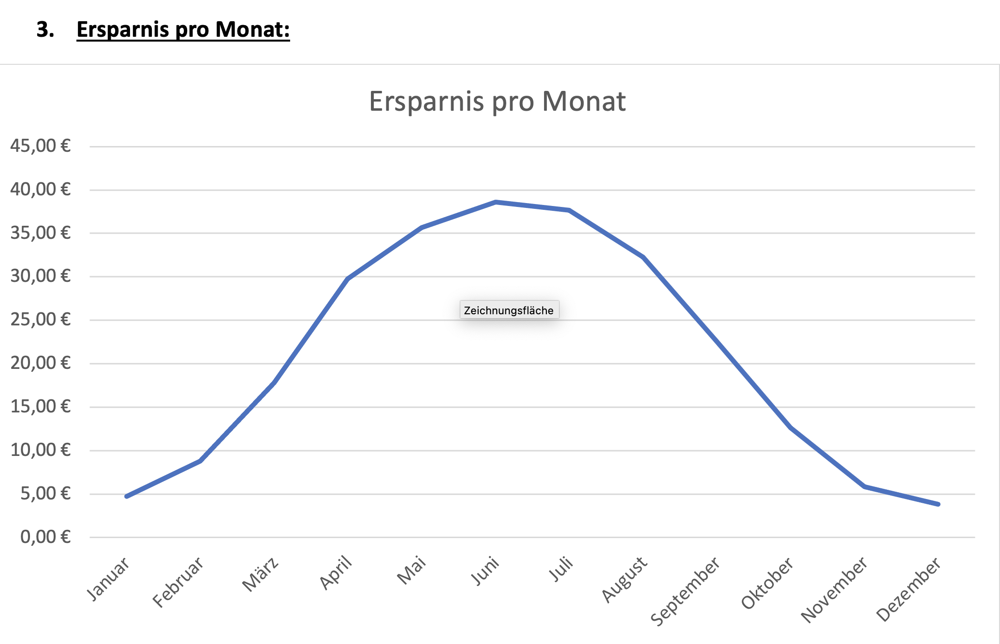
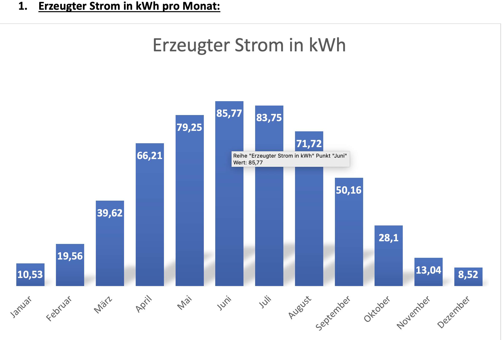

Economic efficiency calculator for balcony solar systems
---
___
Unsere Webanwendung ist in mehrere Bereiche unterteilt. Der erste Bereich ist unsere Informationsausstellung, in der Balkonsolaranwender und Interessierte ausführliche Informationen zum Thema Balkonkraftwerke finden können. Nutzer und Interessierte können die folgenden Themen erkunden:

- Was ist ein Balkonkraftwerk? 
- Wie funktioniert ein Balkonkraftwerk? 
- Die Stromerzeugung eines Balkonkraftwerks
- Ab wann lohnt sich die Investition in ein Balkonkraftwerk wirtschaftlich? 
- Die Voraussetzungen für die Inbetriebnahme eines Balkonkraftwerks
- Fördermöglichkeiten
- Vor- und Nachteile

Es ermöglicht den Nutzern, sich umfassend über Balkonsolaranlagen zu informieren. Falls wir das Interesse möglicher Nutzer geweckt haben, können sie auf unseren Wirtschaftlichkeitsrechner zugreifen, den zweiten Bereich unserer Webanwendung.
Der Wirtschaftlichkeitsrechner ermöglicht es Nutzern und Interessenten, eine detaillierte Prognose für die nächsten Jahre zu erstellen, basierend auf Benutzereingaben wie:

        - Betrachtungszeitraum
        - Standort
        - Anschaffungskosten
        - Stromverbrauch
        - Leistung der Solarmodule
        - Ausrichtung
        - Neigungswinkel
        - Strompreis pro Kilowattstunde

Der Wirtschaftlichkeitsrechner berechnet mithilfe unserer Formeln auf Grundlage der Benutzereingaben die folgenden Werte:

    - Jährliche Stromerzeugung.
    - Jährlicher Eigenverbrauch in Prozent.
    - Jährliche Einsparungen.
    - Einsparungen über den gesamten Betrachtungszeitraum.
    - Amortisationszeit.
    - Reduzierte CO2-Emissionen.

Um unseren Nutzern eine noch präzisere Prognose zu bieten, verwenden wir die PHOTOVOLTAIC GEOGRAPHICAL INFORMATION SYSTEM API (https://re.jrc.ec.europa.eu/pvg_tools/en/), bereitgestellt von der Europäischen Union. Sie ermöglicht uns, auf Grundlage des Standorts der Nutzer die durchschnittliche Sonneneinstrahlung der letzten Jahre zu berechnen, und somit eine noch bessere und genauere Prognose zu erstellen

